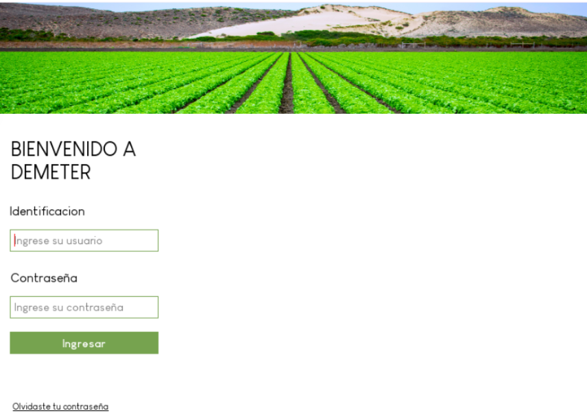
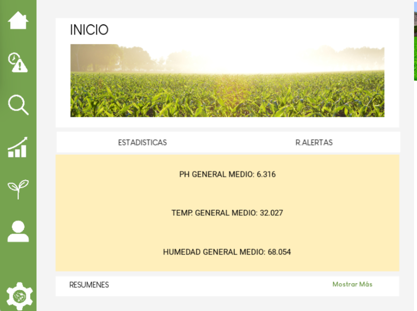
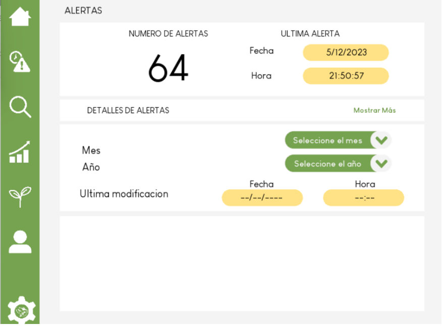
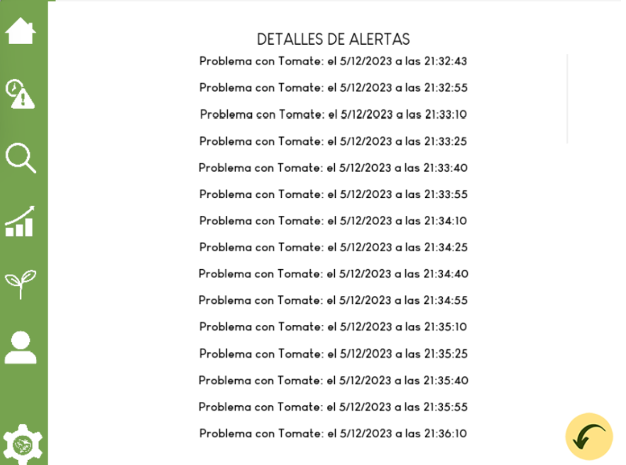
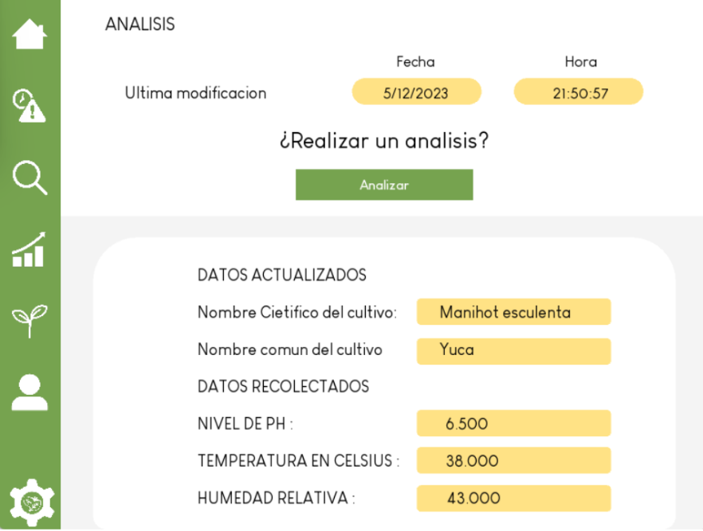
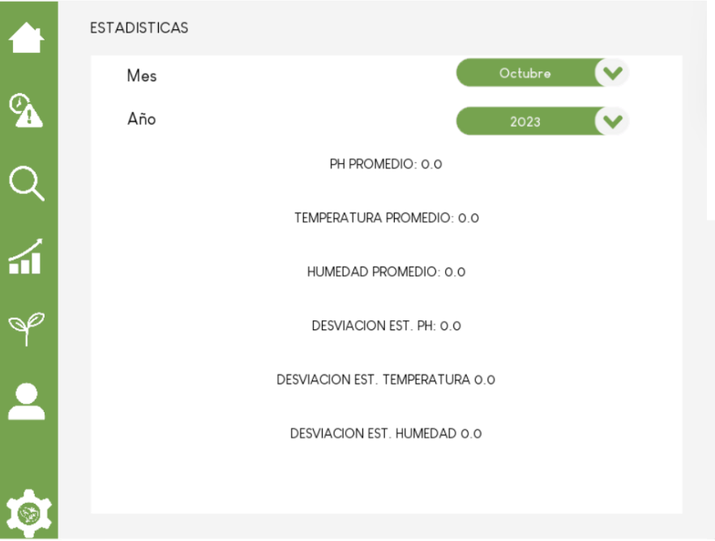
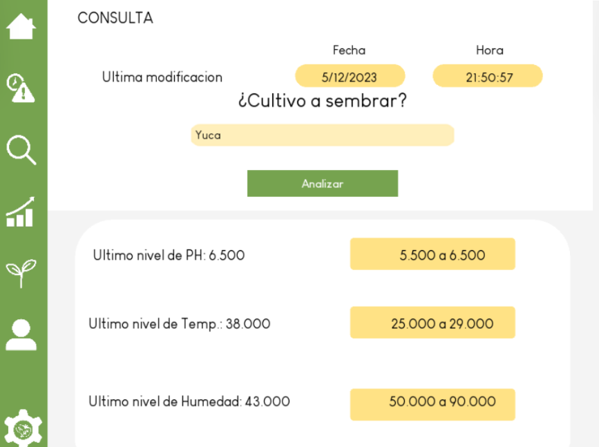
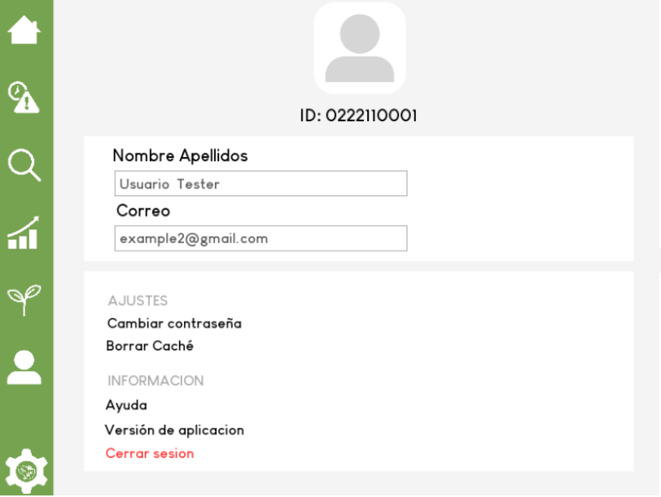

# Demeter - Sistema de Monitoreo Agrícola Inteligente

[](https://github.com/Moya004/ISI_Demeter_2023/tree/master)
[](https://youtu.be/Uy0bKpBZ2j0)
[](https://youtu.be/74DAexUKNQw)

## El Problema / Objetivo

Demeter es una aplicación móvil diseñada para el monitoreo y análisis de condiciones agrícolas, dirigida a pequeños y medianos agricultores que buscan optimizar sus cultivos mediante tecnología accesible. La app resuelve la necesidad de contar con información en tiempo real sobre las condiciones del suelo y ambiente, permitiendo tomar decisiones informadas sobre qué cultivos sembrar y cuándo realizar actividades de mantenimiento, todo desde un dispositivo móvil.

## Stack Tecnológico

- **Framework**: Kivy (Python)
- **Backend**: Python y MicroPython
- **Base de Datos**: Heroku Postgres
- **IDE**: Thonny IDE y Arduino IDE

## Enfoque Técnico & UX

### Arquitectura de la App

Se implementó un enfoque de arquitectura limpia que separa claramente las capas de presentación, lógica y datos:

- **Capa de Presentación**: Archivos `.kv` y controladores de pantalla gestionan la interfaz de usuario
- **Capa de Lógica de Negocio**: `models.py` define las entidades del dominio usando `dataclasses`
- **Capa de Persistencia**: `manageBD.py` actúa como capa de acceso a datos

**Patrones implementados:**

- **Repository Pattern**: Encapsula las consultas a la base de datos
- **MVC (Modelo-Vista-Controlador)**: Vistas en `.kv`, controladores en módulos Python

Esta arquitectura facilita las pruebas, la lectura y extensión del código, permitiendo reemplazar fácilmente la capa de datos por un mock o un servicio diferente para demos o pruebas.

### Consumo de Datos

La aplicación utiliza **Heroku Postgres** como sistema de gestión de base de datos, una solución robusta, escalable y segura que ofrece una de las bases de datos PostgreSQL (Presta, 2021).

**Flujo de datos:**

1. Los sensores recopilan datos del entorno agrícola
2. MicroPython (Thonny IDE) establece conexión con la base de datos
3. Los datos son previamente limpiados antes de su envío
4. Se almacenan en Heroku Postgres para su posterior consulta y análisis

### Decisiones de Diseño

El diseño de la interfaz prioriza la usabilidad y claridad de información para agricultores, con un enfoque en:

- **Visualización clara de datos**: Tarjetas y gráficos que facilitan la comprensión de condiciones ambientales
- **Flujo intuitivo**: Navegación simple entre las diferentes funcionalidades de la app
- **Información accionable**: Los datos se presentan de manera que el usuario pueda tomar decisiones rápidas

A continuación, se muestran las principales pantallas de la aplicación:

---

### Pantallas de la Aplicación

A continuación se presentan los mockups de alta fidelidad del producto final:

**Figura 1: Inicio de Sesión**  


**Figura 2: Pantalla de Inicio**  


**Figura 3: Alertas**  


**Figura 4: Detalles de Alertas**  


**Figura 5: Análisis de Condiciones del Sistema**  


**Figura 6: Estadísticas**  


**Figura 7: Consulta de Cultivos Óptimos**  


**Figura 8: Perfil de Usuario y Ajustes**  


---

> **📌 Nota sobre la ejecución:** La aplicación ha sido desarrollada para conectarse a una base de datos gratuita con tiempo limitado. Al ejecutar el código localmente, se visualizará la primera pantalla, pero debido a las restricciones del servicio de base de datos, no será posible avanzar a las demás vistas. Por esta razón, se incluyen los mockups de todas las pantallas y los videos demostrativos que muestran el funcionamiento completo de la aplicación.

## Videos Demostrativos

### Video Promocional

[Enlace al video promocional](https://www.youtube.com/watch?v=Uy0bKpBZ2j0)  
_Video de presentación del proyecto como producto comercializable, creado para cumplir con el requisito académico de presentar Demeter como una solución lista para el mercado._

### Video de Funcionamiento del Sensor

[Enlace al video de funcionamiento](https://youtu.be/74DAexUKNQw)  
_Demostración técnica del sensor en operación y la comunicación con la base de datos._

## Cómo Ejecutar el Proyecto

```bash
# Clonar el repositorio
git clone link-al-repositorio

# Validar el código
python -m py_compile *.py

# Ejecutar la aplicación
cd ISI_Demeter_2023
python main.py
```

---

[⬅ Volver al inicio](../index.md)
